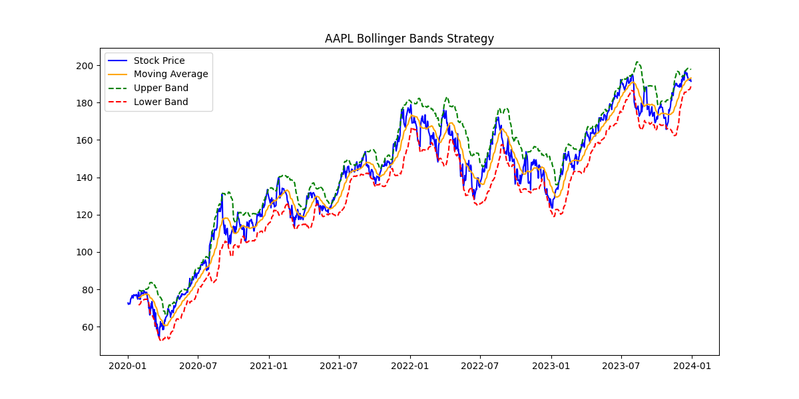
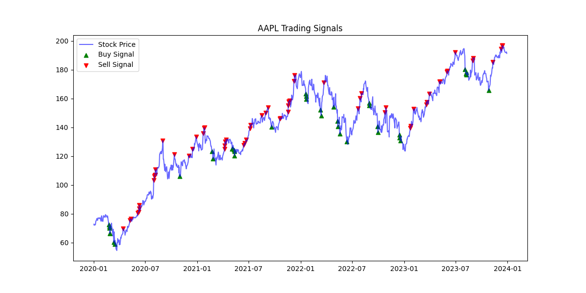
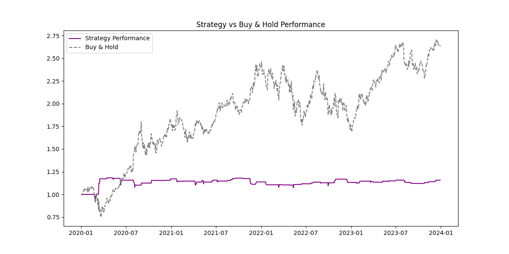
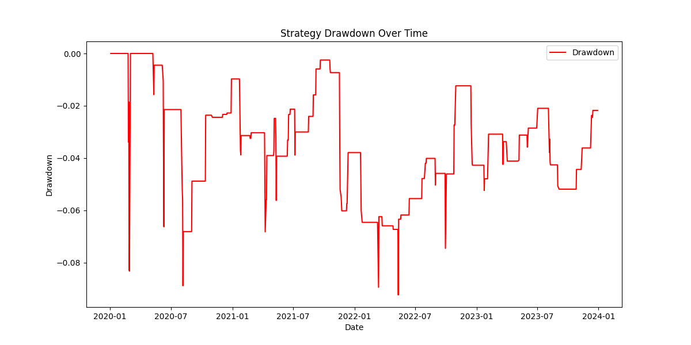

# Bollinger Bands Trading Strategy — AAPL (2020–2024)

This project implements a simple **Bollinger Bands-based trading strategy** using historical price data from Yahoo Finance (via `yfinance`). The strategy identifies **buy and sell signals** based on the relative position of the stock price to its moving average and volatility bands.

The project includes visual outputs to highlight the behavior and effectiveness of the strategy.

---

## Key Features

- **Data**: Apple (AAPL) stock data from 2020–2024
- **Indicators**: 20-day moving average, standard deviation
- **Strategy Logic**:
  - Buy when price drops below lower Bollinger Band
  - Sell when price rises above upper Bollinger Band
- **Backtesting**:
  - Position logic with 1-day trade delay
  - Strategy returns vs Buy & Hold
  - Sharpe Ratio and Max Drawdown
- **Visualization**:
  - Bollinger Bands with signals
  - Cumulative return comparison
  - Drawdown chart

---

## Performance Metrics

- **Sharpe Ratio**: Measures risk-adjusted returns  
- **Max Drawdown**: Worst peak-to-trough loss  

---

### 1. Bollinger Bands Over Time
  
*Stock price with 20-day moving average and upper/lower Bollinger Bands.*

---

### 2. Buy & Sell Signals
  
*Buy signals (green ↑) occur when the price dips below the lower band. Sell signals (red ↓) occur when price exceeds the upper band.*

---

### 3. Strategy vs Buy & Hold Performance
  
*Cumulative returns comparison between the Bollinger Band strategy and passive Buy & Hold.*

---

### 4. Drawdown Over Time
  
*Drawdown chart showing the peak-to-trough losses during the strategy’s performance period.*

---

## Dependencies

- `numpy`
- `pandas`
- `matplotlib`
- `yfinance`

You can install them using:

```bash
pip install numpy pandas matplotlib yfinance


